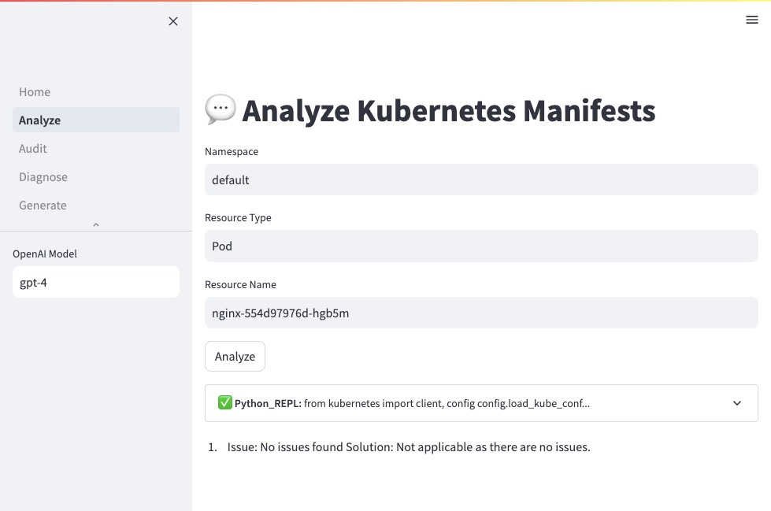

# Kubernetes Copilot

Kubernetes Copilot powered by OpenAI.

Features:

- Automate Kubernetes cluster operations using ChatGPT (GPT-4 or GPT-3.5).
- Diagnose and analyze the potential issues for Kubernetes workloads.
- Generate the Kubernetes manifests based on the provided prompt instructions.
- Utilize native kubectl and trivy commands for Kubernetes cluster access and security vulnerability scanning.
- Access the web and perform Google searches without leaving the terminal.

## Install

### Run in Kubernetes

**Option 1: Web UI with Helm (recommended)**

```sh
# Option 1: OpenAI
export OPENAI_API_KEY="<replace-this>"
helm install kube-copilot kube-copilot \
  --repo https://feisky.xyz/kube-copilot \
  --set openai.apiModel=gpt-4 \
  --set openai.apiKey=$OPENAI_API_KEY

# Option 2: Azure OpenAI Service
export AZURE_OPENAI_API_KEY="<replace-this>"
export AZURE_OPENAI_ENDPOINT="<replace-this>"
helm install kube-copilot kube-copilot \
  --repo https://feisky.xyz/kube-copilot \
  --set openai.apiModel=gpt-4 \
  --set openai.apiKey=$AZURE_OPENAI_API_KEY \
  --set openai.apiBase=$AZURE_OPENAI_ENDPOINT

# Forwarding requests to the service
kubectl port-forward service/kube-copilot 8080:80
echo "Visit http://127.0.0.1:8080 to use the copilot"
```

**Option 2: CLI with kubectl**

```sh
kubectl run -it --rm copilot \
  --env="OPENAI_API_KEY=$OPENAI_API_KEY" \
  --restart=Never \
  --image=ghcr.io/feiskyer/kube-copilot \
  -- execute --verbose 'What Pods are using max memory in the cluster'

kubectl run -it --rm copilot \
  --env="AZURE_OPENAI_API_KEY=$AZURE_OPENAI_API_KEY" \
  --env="AZURE_OPENAI_ENDPOINT=$AZURE_OPENAI_ENDPOINT" \
  --restart=Never \
  --image=ghcr.io/feiskyer/kube-copilot \
  -- execute --verbose 'What Pods are using max memory in the cluster'
```

Refer [kubernetes.md](kubernetes.md) for more detailed steps.

### Local Install

Install the copilot with pip command below:

```sh
pip install kube-copilot
```

**Setup:**

- Ensure [`kubectl`](https://kubernetes.io/docs/tasks/tools/install-kubectl-linux/) is installed on the local machine and the kubeconfig file is configured for Kubernetes cluster access.
- Install [`trivy`](https://github.com/aquasecurity/trivy) to assess container image security issues (for the `audit` command).
- Set the OpenAI [API key](https://platform.openai.com/account/api-keys) as the `OPENAI_API_KEY` environment variable to enable ChatGPT functionality.
  - For [Azure OpenAI service](https://learn.microsoft.com/en-us/azure/cognitive-services/openai/quickstart?tabs=command-line&pivots=rest-api#retrieve-key-and-endpoint), also set `OPENAI_API_TYPE=azure` and `OPENAI_API_BASE=https://<replace-this>.openai.azure.com/`.
- Google search is disabled by default. To enable it, set `GOOGLE_API_KEY` and `GOOGLE_CSE_ID` (obtain from [here](https://cloud.google.com/docs/authentication/api-keys?visit_id=638154888929258210-4085587461) and [here](http://www.google.com/cse/)).

## How to use web UI



## How to use CLI

Running directly in the terminal:

```sh
Usage: kube-copilot [OPTIONS] COMMAND [ARGS]...

  Kubernetes Copilot powered by OpenAI

Options:
  --version  Show the version and exit.
  --help     Show this message and exit.

Commands:
  analyze   analyze issues for a given resource
  audit     audit security issues for a Pod
  diagnose  diagnose problems for a Pod
  execute   execute operations based on prompt instructions
  generate  generate Kubernetes manifests
```

### Audit Security Issues for Pod

`kube-copilot audit POD [NAMESPACE]` will audit security issues for a Pod:

```sh
Usage: kube-copilot audit [OPTIONS] POD [NAMESPACE]

  audit security issues for a Pod

Options:
  --verbose      Enable verbose information of copilot execution steps
  --model MODEL  OpenAI model to use for copilot execution, default is gpt-4
  --help         Show this message and exit.
```

### Diagnose Problems for Pod

`kube-copilot diagnose POD [NAMESPACE]` will diagnose problems for a Pod:

```sh
Usage: kube-copilot diagnose [OPTIONS] POD [NAMESPACE]

  diagnose problems for a Pod

Options:
  --verbose      Enable verbose information of copilot execution steps
  --model MODEL  OpenAI model to use for copilot execution, default is gpt-4
  --help         Show this message and exit.
```

### Analyze Potential Issues for k8s Object

`kube-copilot analyze RESOURCE NAME [NAMESPACE]` will analyze potential issues for the given resource object:

```sh
Usage: kube-copilot analyze [OPTIONS] RESOURCE NAME [NAMESPACE]

  analyze issues for a given resource

Options:
  --verbose     Enable verbose information of copilot execution steps
  --model TEXT  OpenAI model to use for copilot execution, default is gpt-4
  --help        Show this message and exit.
```

### Execute Operations Based on Prompt Instructions

`kube-copilot execute INSTRUCTIONS` will execute operations based on prompt instructions.
It could also be used to ask any questions.

```sh
Usage: kube-copilot execute [OPTIONS] INSTRUCTIONS

  execute operations based on prompt instructions

Options:
  --verbose      Enable verbose information of copilot execution steps
  --model MODEL  OpenAI model to use for copilot execution, default is gpt-4
  --help         Show this message and exit.
```

### Generate Kubernetes Manifests

Use the `kube-copilot generate` command to create Kubernetes manifests based on
the provided prompt instructions. After generating the manifests, you will be
prompted to confirm whether you want to apply them.

```sh
Usage: kube-copilot generate [OPTIONS] INSTRUCTIONS

  generate Kubernetes manifests

Options:
  --verbose     Enable verbose information of copilot execution steps
  --model TEXT  OpenAI model to use for copilot execution, default is gpt-4
  --help        Show this message and exit.
```

## Contribution

The project is opensource at github [feiskyer/kube-copilot](https://github.com/feiskyer/kube-copilot) with Apache License.

If you would like to contribute to the project, please follow these guidelines:

1. Fork the repository and clone it to your local machine.
2. Create a new branch for your changes.
3. Make your changes and commit them with a descriptive commit message.
4. Push your changes to your forked repository.
5. Open a pull request to the main repository.
